<!--Number of visits-->
<div style="display: flex; align-items: center;">
  <!-- 網站訪問人數 -->
  <span>views</span>&emsp;

  <!-- 網站訪問人數 -->
  <span></span>&emsp;

  <!-- wakatime -->
  <a href="https://wakatime.com/@dennisLin"></a>&emsp;
</div>

<div>
  <!-- 打程式人 -->
  
</div>

<!-- 歡迎詞 -->
<!-- <h1 align="center">I'm a passionate frontend developer from Taiwan :relaxed:</h1> -->

<!-- 打字特效 -->
<div align="left">
  
</div>

<!-- 貪食蛇 -->
<picture>
  <source media="(prefers-color-scheme: dark)" srcset="https://dennislin0125.github.io/asset/svg/github-contribution-grid-snake-dark.svg" />
  <source media="(prefers-color-scheme: light)" srcset="https://dennislin0125.github.io/asset/svg/github-contribution-grid-snake.svg" />
  
</picture>

<!-- wakatime -->
### 📊 WakaTime&emsp;

<i>

</i>

<picture>
  <source
    srcset="https://github-readme-stats.vercel.app/api/wakatime?username=dennislin&layout=compact&text_color=f0f6fc&bg_color=00000000&hide_border=true&hide_title=true"
    media="(prefers-color-scheme: dark)"
  />
  <source
    srcset="https://github-readme-stats.vercel.app/api/wakatime?username=dennislin&layout=compact&text_color=1f2328&bg_color=00000000&hide_border=true&hide_title=true"
    media="(prefers-color-scheme: light), (prefers-color-scheme: no-preference)"
  />
  
</picture>

<!-- GitHub 活動統計圖 -->
[](https://github.com/ashutosh00710/github-readme-activity-graph)

<!-- 展示 table-->
<table>
  <tr>
    <td>
      
    </td>
    <td>
      
    </td>
  </tr>

  <tr>
    <td>
      
    </td>
    <td>
      
    </td>
  </tr>

  <tr>
    <td>
      
    </td>
    <td>
      
    </td>
  </tr>

  <tr>
    <td>
      
    </td>
    <td>
      
    </td>
  </tr>

  <tr>
    <td>
      
    </td>
    <td>
      
    </td>
  </tr>

  <tr>
    <td>
      
    </td>
    <td>
      
    </td>
  </tr>

  <tr>
    <td>
      
    </td>
    <td>
      
    </td>
  </tr>
</table>

<!--START_SECTION:waka-->
**I'm a Night 🦉** 

```text
🌞 Morning                263 commits         ████░░░░░░░░░░░░░░░░░░░░░   15.26 % 
🌆 Daytime                466 commits         ███████░░░░░░░░░░░░░░░░░░   27.03 % 
🌃 Evening                955 commits         ██████████████░░░░░░░░░░░   55.39 % 
🌙 Night                  40 commits          █░░░░░░░░░░░░░░░░░░░░░░░░   02.32 % 
```
📅 **I'm Most Productive on Sunday** 

```text
Monday                   237 commits         ███░░░░░░░░░░░░░░░░░░░░░░   13.75 % 
Tuesday                  294 commits         ████░░░░░░░░░░░░░░░░░░░░░   17.05 % 
Wednesday                184 commits         ███░░░░░░░░░░░░░░░░░░░░░░   10.67 % 
Thursday                 153 commits         ██░░░░░░░░░░░░░░░░░░░░░░░   08.87 % 
Friday                   145 commits         ██░░░░░░░░░░░░░░░░░░░░░░░   08.41 % 
Saturday                 264 commits         ████░░░░░░░░░░░░░░░░░░░░░   15.31 % 
Sunday                   447 commits         ██████░░░░░░░░░░░░░░░░░░░   25.93 % 
```


📊 **This Week I Spent My Time On** 

```text
🕑︎ Time Zone: Asia/Taipei

💬 Programming Languages: 
No Activity Tracked This Week

🔥 Editors: 
No Activity Tracked This Week

💻 Operating System: 
No Activity Tracked This Week
```


 Last Updated on 27/12/2025 16:31:59 UTC
<!--END_SECTION:waka-->

<!-- 特色專案 -->
<h3 align="left">🔭 Currently working on:</h3>

<p align="center">
    
    
</p>

<!-- 目前學習 -->
<h3 align="left">🌱 Recently completed projects:</h3>

<p align="center">
    
    
</p>

<!-- 動畫  -->
<p align="center">
  <!-- 重訓 -->
  <!--  -->
  <!-- 貓咪 -->
  
  <!-- 獎盃 -->
  
</p>

<!-- 💪 Often use: -->
<h3 align="center">💪 Often use:</h3>
<p align="center">
  <span >
    <code></code>
    <code></code>
    <code></code>
    <code></code>
    <code></code>
    <code></code>
    <code></code>
    <code></code>
    <code></code>
    <code></code>
    <code></code>
    <code></code>
    <code></code>
    <code></code>
  </span>
</p>

<!-- 🧠 Languages -->
<h3 align="center">🧠 Languages:</h3>
<p align="center">
  <span>
    
    
    
    
    
    
    
    
    
    
    
    
    <!--  -->
  </span>
</p>

<!--🧰 Commonly used tools -->
<h3 align="center">🧰 Commonly used tools:</h3>
<p align="center">
  
  
  
  <!--  -->
  
  <br>
  <!-- svg -->
  
  
  
  
  
  
  
  
  
  
  
  <!-- <br> -->
  <br>
  <!-- gif -->
  
  
  
  
  
  
  
  
</p>

<div align="center">
  <!-- 鴨子 -->
  
  
  <!-- 鴨子 -->
  

</div>

<div align="center">
  <!-- 左翅膀  -->
  
  
  <!-- 右翅膀  -->
  
</div>

<div align="center">
  <p>
    <!-- 公開倉庫數量、貢獻度、追蹤者數量 -->
    
    <!-- 程式種類統計 -->
    
  </p>
</div>
<!-- 程式種類統計 -->

<!--獎盃-->
<div align="center">
  
</div>

<!--
**DennisLin0125/DennisLin0125** is a ✨ _special_ ✨ repository because its `README.md` (this file) appears on your GitHub profile.

Here are some ideas to get you started:

- 🔭 I’m currently working on ...
- 🌱 I’m currently learning ...
- 👯 I’m looking to collaborate on ...
- 🤔 I’m looking for help with ...
- 💬 Ask me about ...
- 📫 How to reach me: ...
- 😄 Pronouns: ...
- ⚡ Fun fact: ...
-->
