<!-- 打字特效 -->
[](https://git.io/typing-svg)

<!-- 歡迎詞 -->
<h1 align="center">I'm a passionate frontend developer from Taiwan :relaxed:</h1>

<!-- 網站訪問人數 -->
<p align="left"> 
   
  <span > 
     
     
     
  </span>
</p>

<!-- GitHub 活動統計圖 -->
[](https://github.com/ashutosh00710/github-readme-activity-graph)

<table>
  <tr>
    <td>
      
    </td>
    <td>
      
    </td>
  </tr>

  <tr>
    <td>
      
    </td>
    <td>
      
    </td>
  </tr>

  <tr>
    <td>
      
    </td>
    <td>
      
    </td>
  </tr>

  <tr>
    <td>
      
    </td>
    <td>
      
    </td>
  </tr>

  <tr>
    <td>
      
    </td>
    <td>
      
    </td>
  </tr>

  <tr>
    <td>
      
    </td>
    <td>
      
    </td>
  </tr>

  <tr>
    <td>
      
    </td>
    <td>
      
    </td>
  </tr>
</table>

<!--START_SECTION:waka-->
**I'm a Night 🦉** 

```text
🌞 Morning                232 commits         █████░░░░░░░░░░░░░░░░░░░░   19.17 % 
🌆 Daytime                63 commits          █░░░░░░░░░░░░░░░░░░░░░░░░   05.21 % 
🌃 Evening                310 commits         ██████░░░░░░░░░░░░░░░░░░░   25.62 % 
🌙 Night                  605 commits         ████████████░░░░░░░░░░░░░   50.00 % 
```
📅 **I'm Most Productive on Monday** 

```text
Monday                   268 commits         ██████░░░░░░░░░░░░░░░░░░░   22.15 % 
Tuesday                  138 commits         ███░░░░░░░░░░░░░░░░░░░░░░   11.40 % 
Wednesday                192 commits         ████░░░░░░░░░░░░░░░░░░░░░   15.87 % 
Thursday                 108 commits         ██░░░░░░░░░░░░░░░░░░░░░░░   08.93 % 
Friday                   55 commits          █░░░░░░░░░░░░░░░░░░░░░░░░   04.55 % 
Saturday                 236 commits         █████░░░░░░░░░░░░░░░░░░░░   19.50 % 
Sunday                   213 commits         ████░░░░░░░░░░░░░░░░░░░░░   17.60 % 
```


📊 **This Week I Spent My Time On** 

```text
🕑︎ Time Zone: America/Los_Angeles

💬 Programming Languages: 
YAML                     1 hr 18 mins        ███████████████░░░░░░░░░░   59.66 % 
Markdown                 35 mins             ███████░░░░░░░░░░░░░░░░░░   26.74 % 
JavaScript               11 mins             ██░░░░░░░░░░░░░░░░░░░░░░░   08.50 % 
HTML                     5 mins              █░░░░░░░░░░░░░░░░░░░░░░░░   04.57 % 
XML                      0 secs              ░░░░░░░░░░░░░░░░░░░░░░░░░   00.53 % 

🔥 Editors: 
VS Code                  2 hrs 11 mins       █████████████████████████   100.00 % 

💻 Operating System: 
Windows                  2 hrs 11 mins       █████████████████████████   100.00 % 
```


 Last Updated on 19/10/2023 09:19:11 UTC
<!--END_SECTION:waka-->


<!-- 特色專案 -->
<h3 align="left">🔭 I’m currently working on:</h3>

[](https://github.com/DennisLin0125/Vue3)
[](https://github.com/DennisLin0125/React)

<!-- 目前學習 -->
<h3 align="left">🌱 I’m currently learning:</h3>

[](https://github.com/DennisLin0125/MongoDB_Node_js)
[](https://github.com/DennisLin0125/Promise)


<!-- 個人興趣 -->
- 💬 Ask me about **Vue.js, C, Python**

- 📫 How to reach me **740125aa@gmail.com**

<!-- 程式 -->
<h3 align="left">Languages:</h3>
<p align="left">
  <!-- C -->
  <a href="https://www.cprogramming.com/" target="_blank" rel="noreferrer"> 
     
  </a> 
  <!-- C++ -->
  <a href="https://www.w3schools.com/cpp/" target="_blank" rel="noreferrer"> 
     
  </a> 
  <!-- javascript -->
  <a href="https://developer.mozilla.org/en-US/docs/Web/JavaScript" target="_blank" rel="noreferrer"> 
     
  </a> 
  <!-- python -->
  <a href="https://www.python.org" target="_blank" rel="noreferrer"> 
     
  </a> 
  <!-- nodejs -->
  <a href="https://nodejs.org" target="_blank" rel="noreferrer"> 
     
  </a>
</p>

<!-- 前端開發區 -->
<h3 align="left">Frontend Development:</h3>
<p align="left"> 
  <!-- Vue -->
  <a href="https://vuejs.org/" target="_blank" rel="noreferrer"> 
     
  </a> 
  <!-- React -->
  <a href="https://reactjs.org/" target="_blank" rel="noreferrer"> 
     
  </a>
  <!-- redux -->
  <a href="https://redux.js.org" target="_blank" rel="noreferrer"> 
     
  </a>
  <!-- CSS -->
  <a href="https://www.w3schools.com/css/" target="_blank" rel="noreferrer"> 
     
  </a> 
  <!-- bootstrap -->
  <a href="https://getbootstrap.com" target="_blank" rel="noreferrer"> 
     
  </a> 
  <!-- html5 -->
  <a href="https://www.w3.org/html/" target="_blank" rel="noreferrer"> 
     
  </a>
  <!-- webpack -->
  <a href="https://webpack.js.org" target="_blank" rel="noreferrer"> 
     
  </a> 
</p>

<!-- Technology -->
<h3 align="left">Technology:</h3>
<p align="left"> 
   <!-- mysql -->
  <a href="https://www.mysql.com/" target="_blank" rel="noreferrer"> 
     
  </a>
  <!-- mongodb -->
  <a href="https://www.mongodb.com/" target="_blank" rel="noreferrer"> 
     
  </a> 
  <!-- firebase -->
  <a href="https://firebase.google.com/" target="_blank" rel="noreferrer"> 
     
  </a> 
  <!-- heroku -->
  <a href="https://heroku.com" target="_blank" rel="noreferrer"> 
     
  </a> 
  <!-- express -->
  <a href="https://expressjs.com" target="_blank" rel="noreferrer"> 
     
  </a>
  <!-- AWS -->
  <a href="https://aws.amazon.com" target="_blank" rel="noreferrer"> 
   
  </a> 
  <!-- docker -->
  <a href="https://www.docker.com/" target="_blank" rel="noreferrer"> 
     
  </a> 
  <!-- linux -->
  <a href="https://www.linux.org/" target="_blank" rel="noreferrer"> 
     
  </a> 
</p>

<div align="left">

[](https://https://github.com/DennisLin0125)

</div>

<div align="left">

<!-- GitHub用戶的貢獻與活躍度 -->
[](https://git.io/streak-stats)

</div>


<div align="left">
  <p>
    <!-- 公開倉庫數量、貢獻度、追蹤者數量 -->
    
    <!-- 程式種類統計 -->
    
  </p>
</div>
<!-- 程式種類統計 -->


<!--獎盃-->
<div align="center"> 
   
</div>


<!--
**DennisLin0125/DennisLin0125** is a ✨ _special_ ✨ repository because its `README.md` (this file) appears on your GitHub profile.

Here are some ideas to get you started:

- 🔭 I’m currently working on ...
- 🌱 I’m currently learning ...
- 👯 I’m looking to collaborate on ...
- 🤔 I’m looking for help with ...
- 💬 Ask me about ...
- 📫 How to reach me: ...
- 😄 Pronouns: ...
- ⚡ Fun fact: ...
-->
